# Hey, I'm Hαzε 👾

German transfem dev  & CS student · she/her · Writing code for the games I'm already too deep into

---

## 📊 By the Numbers

  

---

## 🛠️ Stack

---

## 🗂️ Projects

### 🏎️ [Mario Kart World Point Calculator](https://github.com/Hazeolation/Mario-Kart-World_Point-Calculator)
A WPF/C# desktop app for tracking scores in **Mario Kart World** competitive matches, scrimmages and lounge mogis. Supports 12- and 24-player rooms across a bunch of formats (6v6, 4v4v4, FFA chaos, you name it) — auto-calculates race scores, tracks cumulative totals and score diffs, and even loads track images dynamically. Built because competitive MKW deserves proper tooling.

### 🐙 [Myopsidus Bot](https://github.com/Hazeolation/Myopsidus)
A Discord bot built for the competitive Splatoon team **Myopsidus** — my team. Does what a competitive team's bot needs to do.

---

## 🎮 Gaming

### 🦑 Competitive Splatoon

Active player and tournament organiser in the EU scene. Currently on **endless vacation** (Flex). Previously: Myopsidus, Dive!, SoniSea.

**Where you might see me:**

| Org | Role |
|-----|------|
| [Dapple Productions](https://sendou.ink/org/dapple-productions) | Paddling Pool Head TO |
| [Inkterior Designs](https://sendou.ink/org/inkterior-designs) | Head TO, all EU Tourneys |
| [Deutsche Splatoon Bundesliga](https://sendou.ink/org/deutsche-splatoon-bundesliga) | Turnierleiter |

**Divisions:** LUTI Div2 · LHL Div1 · DSB Div1

**Tournament record:** 🥇×2 · 🥈×11 · 🥉×6 *(Yes, I am aware of the silver problem)*

**Weapons:** Slosher · Tri-Stringer · Splattershot · N-ZAP '85

🔗 [sendou.ink/u/hazeolation](https://sendou.ink/u/hazeolation/)

---

### 💀 Dead by Daylight & Steam

446+ hours in DBD. I take achievements seriously enough to 100% spinoffs and write long reviews about them. Make of that what you will.

**Currently grinding:** Dead by Daylight · Schedule I · Halo: MCC

**Also playing:** Balatro · Hitman World of Assassination · Overcooked 2 · PowerWash Simulator

**Steam:** 216 games · 3,198 achievements · 20 perfect games · Level 51

🔗 [steamcommunity.com/id/hazeolation](https://steamcommunity.com/id/hazeolation/)

---

### 🍿 Off the Controller

Big fan of **Bocchi the Rock** and **Lycoris Recoil** · Probably watching one of them right now

---

## 📬 Find Me

💬 Discord: `hazeolation`
&nbsp;·&nbsp;
📺 [twitch.tv/hazeolation](https://www.twitch.tv/hazeolation)
&nbsp;·&nbsp;
🐦 [@SDomi19](https://www.x.com/SDomi19)
&nbsp;·&nbsp;
🎮 [sendou.ink](https://sendou.ink/u/hazeolation/)

---

  

<i>Not good, but enjoying improving</i>

